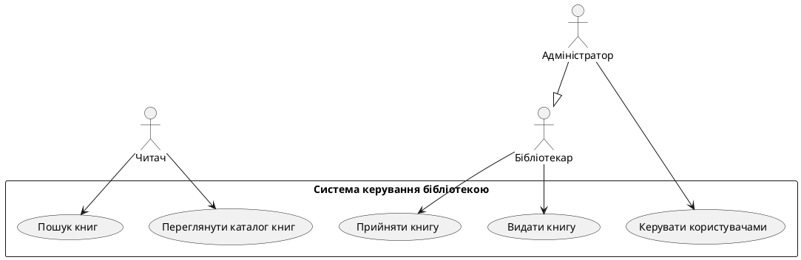

# Система керування бібліотекою

> Курсова робота з розробки програмного забезпечення
>
> Full-stack веб-застосунок для автоматизації процесів роботи бібліотеки

[](https://www.oracle.com/java/)
[](https://spring.io/projects/spring-boot)
[](https://reactjs.org/)
[](https://www.postgresql.org/)
[](https://www.docker.com/)

---

## 📚 Зміст

1. [Технічне завдання](#1-технічне-завдання)
2. [Use Case діаграми](#2-use-case-діаграми)
3. [ORM та структура БД](#3-orm-та-структура-бд)
4. [Wireframes інтерфейсу](#4-wireframes-інтерфейсу)
5. [Реалізація Front-End](#5-реалізація-front-end)
6. [SOLID принципи](#6-solid-принципи)
7. [Патерни проектування](#7-патерни-проектування)
8. [Sequence діаграми](#8-sequence-діаграми)
9. [Docker та розгортання](#9-docker-та-розгортання)
10. [Швидкий старт](#10-швидкий-старт)

---

## 1. Технічне завдання

### 1.1 Загальний опис

Веб-система для керування бібліотекою - це комплексне рішення для автоматизації процесів роботи бібліотеки, включаючи облік книг, користувачів, позик та бронювань. Система побудована на основі сучасних технологій та архітектурних патернів.

### 1.2 Мета проекту

Розробка масштабованого веб-застосунку для ефективного управління книжковим фондом, обліку користувачів та автоматизації процесів видачі і повернення книг з дотриманням принципів SOLID та використанням патернів проектування.

### 1.3 Цільова аудиторія

- **Адміністратори** - повний контроль над системою
- **Бібліотекарі** - управління книгами та позиками
- **Читачі** - перегляд каталогу та своїх позик

### 1.4 Функціональні вимоги

#### Управління книгами
- ✅ Додавання, редагування та видалення книг
- ✅ Пошук книг за назвою, автором, категорією
- ✅ Перегляд інформації про книгу (ISBN, автори, видавництво, доступність)
- ✅ Відстеження доступності книг в реальному часі

#### Управління користувачами
- ✅ Реєстрація та автентифікація (JWT)
- ✅ Три ролі: ADMIN, LIBRARIAN, READER
- ✅ Role-based доступ до функціоналу
- ✅ Управління обліковими записами

#### Управління позиками
- ✅ Видача книг користувачам
- ✅ Повернення книг
- ✅ Продовження терміну позики
- ✅ Автоматичний розрахунок штрафів (5 грн/день)
- ✅ Відстеження прострочених позик

#### Управління бронюваннями
- ✅ Бронювання недоступних книг
- ✅ Автоматичне скасування прострочених бронювань

### 1.5 Нефункціональні вимоги

- ✅ **Відмовостійкість:** Docker healthchecks, graceful shutdown
- ✅ **Масштабованість:** Модульна архітектура, stateless backend
- ✅ **Безпека:** JWT токени, BCrypt хешування паролів, CORS
- ✅ **Зручність:** Інтуїтивний UI, адаптивний дизайн
- ✅ **Продуктивність:** Connection pooling, lazy loading, індекси БД

### 1.6 Технологічний стек

#### Backend
- **Java 17** - Мова програмування
- **Spring Boot 3.2.0** - Framework
- **Spring Data JPA** - ORM
- **Spring Security** - Безпека
- **PostgreSQL 16** - База даних
- **Maven** - Управління залежностями
- **Lombok** - Зменшення boilerplate коду

#### Frontend
- **React 18.2.0** - UI бібліотека
- **React Router 6** - Маршрутизація
- **Axios** - HTTP клієнт
- **CSS3** - Стилізація

#### DevOps
- **Docker** - Контейнеризація
- **Docker Compose** - Оркестрація
- **Nginx** - Reverse proxy
- **GitHub** - Version control

---

## 2. Use Case діаграми

Система підтримує різні сценарії використання для кожної ролі користувача.

### Повна документація
📄 **[Use Case Діаграми](docs/diagrams/use-case-diagram.md)** - PlantUML діаграми та детальний опис

### Основні сценарії

#### Читач (Reader)
- 📖 Перегляд каталогу книг
- 🔍 Пошук книг (за назвою, автором, категорією)
- 📋 Перегляд своїх позик
- ⏱️ Продовження позики
- 📚 Бронювання книг

#### Бібліотекар (Librarian)
- ➕ Додавання/редагування/видалення книг
- 📤 Видача книг користувачам
- 📥 Прийом повернених книг
- 💰 Розрахунок штрафів
- ⚠️ Перегляд прострочених позик

#### Адміністратор (Admin)
- 👥 Керування користувачами
- 📊 Перегляд статистики системи
- ⚙️ Налаштування системи
- 📝 Керування авторами та категоріями
- ✅ Всі функції Бібліотекаря

### Діаграма (PlantUML)



---

## 3. ORM та структура БД

Проект використовує **Hibernate/JPA** для ORM та **PostgreSQL** як СУБД.

### Повна документація
📄 **[Database Діаграма та SQL](docs/diagrams/database-diagram.md)** - ER діаграма, SQL DDL, нормалізація

### Основні сутності

#### 🗂️ Таблиці

| Таблиця | Опис | Зв'язки |
|---------|------|---------|
| **users** | Користувачі системи | 1-* loans, 1-* reservations |
| **books** | Книжковий фонд | 1-* loans, *-* authors, *-* categories |
| **loans** | Позики книг | *-1 user, *-1 book |
| **reservations** | Бронювання книг | *-1 user, *-1 book |
| **authors** | Автори | *-* books |
| **categories** | Категорії книг | *-* books |

#### 📊 ER Діаграма

```
┌──────────┐       ┌──────────┐       ┌──────────┐
│  users   │1─────*│  loans   │*─────1│  books   │
└──────────┘       └──────────┘       └──────────┘
     │                                      │
     │1                                    *│
     │                                      │
     │             ┌──────────┐             │
     └────────────*│   res.   │*────────────┘
                   └──────────┘

┌──────────┐                   ┌──────────┐
│ authors  │*─────────────────*│  books   │
└──────────┘  book_authors     └──────────┘

┌──────────┐                   ┌──────────┐
│categories│*─────────────────*│  books   │
└──────────┘  book_categories  └──────────┘
```

### ORM Mapping (приклад)

**Book Entity (backend/src/main/java/com/library/model/Book.java)**
```java
@Entity
@Table(name = "books")
public class Book {
    @Id
    @GeneratedValue(strategy = GenerationType.IDENTITY)
    private Long id;

    @Column(nullable = false, unique = true, length = 20)
    private String isbn;

    @Column(nullable = false, length = 255)
    private String title;

    @ManyToMany(fetch = FetchType.LAZY)
    @JoinTable(name = "book_authors",
        joinColumns = @JoinColumn(name = "book_id"),
        inverseJoinColumns = @JoinColumn(name = "author_id"))
    private Set<Author> authors = new HashSet<>();

    @OneToMany(mappedBy = "book", cascade = CascadeType.ALL)
    private Set<Loan> loans = new HashSet<>();
}
```

### Нормалізація: 3NF

База даних відповідає **Третій нормальній формі (3NF)**:
- ✅ 1NF: Атомарні значення, первинні ключі
- ✅ 2NF: Немає часткових залежностей
- ✅ 3NF: Немає транзитивних залежностей

---

## 4. Wireframes інтерфейсу

Дизайн інтерфейсу адаптований для різних ролей користувачів.

### Повна документація
📄 **[Wireframes та UI Design](docs/diagrams/wireframes.md)** - ASCII wireframes, кольорова схема, адаптивний дизайн

### Основні екрани

#### 📚 Каталог книг
```
┌──────────────────────────────────────┐
│  [Пошук: ____________] [🔍 Шукати]  │
├──────────────────────────────────────┤
│  ┌─────────┐  ┌─────────┐           │
│  │ 📖      │  │ 📖      │           │
│  │ Кобзар  │  │ Захар   │  ...      │
│  │         │  │ Беркут  │           │
│  │ ✅ Доступ│  │ ⚠️ Видана│           │
│  └─────────┘  └─────────┘           │
└──────────────────────────────────────┘
```

#### 📋 Позики
```
┌──────────────────────────────────────┐
│  ┌── Кобзар ──────────── ✅ Активна┐│
│  │ Користувач: ivan                 ││
│  │ Термін: 29.11.2025               ││
│  │ [Повернути] [Продовжити]         ││
│  └──────────────────────────────────┘│
│                                      │
│  ┌── Захар Беркут ──── ⚠️ Прострочена┐│
│  │ Користувач: maria                ││
│  │ Штраф: 70.00 грн                 ││
│  │ [Повернути]                      ││
│  └──────────────────────────────────┘│
└──────────────────────────────────────┘
```

### Кольорова схема
- 🔵 **Основний:** #2c3e50 (header, footer)
- 🔷 **Акцент:** #3498db (кнопки, посилання)
- 🟢 **Успіх:** #27ae60 (доступні книги)
- 🟠 **Попередження:** #f39c12 (попередження)
- 🔴 **Помилка:** #e74c3c (прострочення)

---

## 5. Реалізація Front-End

React-based SPA з роль-специфічними інтерфейсами.

### Повна документація
📄 **[Frontend Архітектура](docs/FRONTEND.md)** - Компоненти, сервіси, маршрутизація, авторизація

### Архітектура

```
┌─────────────────────────────────────┐
│         App.js (Router)             │
├─────────────────────────────────────┤
│  Components:                        │
│  - AdminDashboard    (ADMIN)        │
│  - LibrarianDashboard (LIBRARIAN)   │
│  - ReaderDashboard   (READER)       │
│  - BookList          (All)          │
│  - LoanList          (All)          │
│  - Login             (Public)       │
├─────────────────────────────────────┤
│  Services:                          │
│  - bookService.js                   │
│  - loanService.js                   │
│  - authService.js                   │
│  - api.js (Axios + Interceptors)    │
└─────────────────────────────────────┘
```

### Ключові можливості

- ✅ **Component-Based:** Модульна структура
- ✅ **React Hooks:** useState, useEffect для управління станом
- ✅ **Protected Routes:** Захист маршрутів на основі JWT
- ✅ **Role-Based UI:** Різні dashboard для різних ролей
- ✅ **Responsive Design:** Mobile-first підхід
- ✅ **Modal Windows:** Форми додавання книг/користувачів
- ✅ **Error Handling:** Користувацькі повідомлення про помилки

### Приклад компонента

**AdminDashboard.js**
```javascript
function AdminDashboard() {
  const [stats, setStats] = useState({
    totalBooks: 0,
    availableBooks: 0,
    activeLoans: 0,
    overdueLoans: 0
  });

  useEffect(() => {
    loadDashboardData();
  }, []);

  const loadDashboardData = async () => {
    const [books, available, loans, overdue] = await Promise.all([
      bookService.getAllBooks(),
      bookService.getAvailableBooks(),
      loanService.getAllLoans(),
      loanService.getOverdueLoans()
    ]);
    setStats({ /* ... */ });
  };

  return (
    <div className="dashboard-container">
      <StatsGrid stats={stats} />
      <ActionButtons />
      <RecentBooks />
    </div>
  );
}
```

---

## 6. SOLID принципи

Архітектура backend послідовно дотримується всіх п'яти SOLID принципів.

### Повна документація
📄 **[SOLID Принципи](docs/SOLID.md)** - Детальний аналіз з прикладами коду

### Застосування принципів

#### 1️⃣ Single Responsibility Principle (SRP)

Кожен клас має одну відповідальність:

```
BookController    → HTTP requests (тільки)
BookService       → Business logic (тільки)
BookRepository    → Data access (тільки)
BookMapper        → Entity ↔ DTO (тільки)
Book (Entity)     → Data model (тільки)
```

**Приклад:** `backend/src/main/java/com/library/service/impl/BookServiceImpl.java:15-23`

#### 2️⃣ Open/Closed Principle (OCP)

Використання інтерфейсів дозволяє розширювати без модифікації:

```java
public interface BookService {
    BookDTO createBook(BookDTO bookDTO);
    // ...
}

// Можна додати нову реалізацію без зміни існуючого коду
@Service
public class CachedBookServiceImpl implements BookService { }
```

#### 3️⃣ Liskov Substitution Principle (LSP)

Будь-яку реалізацію можна замінити:

```java
@RestController
public class BookController {
    private final BookService bookService; // Може бути будь-яка реалізація
}
```

#### 4️⃣ Interface Segregation Principle (ISP)

Розділені інтерфейси для кожної сутності:

```java
public interface BookService { /* методи для книг */ }
public interface LoanService { /* методи для позик */ }
public interface UserService { /* методи для користувачів */ }
```

#### 5️⃣ Dependency Inversion Principle (DIP)

Залежність від абстракцій через Constructor Injection:

```java
@Service
public class BookServiceImpl implements BookService {
    private final BookRepository bookRepository; // Інтерфейс
    private final BookMapper bookMapper;         // Інтерфейс

    public BookServiceImpl(BookRepository bookRepository,
                          BookMapper bookMapper) {
        this.bookRepository = bookRepository;
        this.bookMapper = bookMapper;
    }
}
```

---

## 7. Патерни проектування

В проекті використано 10 класичних патернів проектування.

### Повна документація
📄 **[Design Patterns](docs/DESIGN_PATTERNS.md)** - Детальний опис з діаграмами та прикладами

### Застосовані патерни

| # | Патерн | Локація | Призначення |
|---|--------|---------|-------------|
| 1 | **Repository** | `repository/` | Абстракція доступу до даних |
| 2 | **Service Layer** | `service/impl/` | Централізація бізнес-логіки |
| 3 | **DTO** | `dto/` | Передача даних між шарами |
| 4 | **Adapter (Mapper)** | `mapper/` | Конвертація Entity ↔ DTO |
| 5 | **Strategy** | Fine calculation | Взаємозамінні алгоритми штрафів |
| 6 | **Dependency Injection** | Spring | Інверсія контролю |
| 7 | **MVC** | Controller-Service-Model | Розділення відповідальностей |
| 8 | **Builder** | Lombok `@Builder` | Побудова об'єктів |
| 9 | **Singleton** | Spring Beans | Єдиний екземпляр |
| 10 | **Template Method** | Spring Data JPA | Скелет алгоритму |

### Приклад: Repository Pattern

```java
@Repository
public interface BookRepository extends JpaRepository<Book, Long> {
    Optional<Book> findByIsbn(String isbn);
    List<Book> findByTitleContainingIgnoreCase(String title);

    @Query("SELECT b FROM Book b JOIN b.authors a WHERE ...")
    List<Book> findByAuthorName(@Param("name") String authorName);
}
```

**Переваги:**
- ✅ Абстракція від деталей БД
- ✅ Централізація запитів
- ✅ Легке тестування (mock)

### Приклад: Strategy Pattern (Fine Calculation)

```java
// Поточна реалізація
if (loan.isOverdue()) {
    long daysOverdue = loan.getDaysOverdue();
    BigDecimal fine = FINE_PER_DAY.multiply(new BigDecimal(daysOverdue));
    loan.setFineAmount(fine);
}

// Можна легко розширити різними стратегіями:
// - LinearFineStrategy (5 грн/день)
// - ProgressiveFineStrategy (5 грн/день перший тиждень, 10 грн/день потім)
// - CappedFineStrategy (максимум 100 грн)
```

---

## 8. Sequence діаграми

Діаграми послідовностей для основних процесів системи.

### Повна документація
📄 **[Sequence Діаграми](docs/diagrams/sequence-diagrams.md)** - PlantUML діаграми для всіх процесів

### Основні процеси

#### 1. Видача книги (Create Loan)

```
Бібліотекар → Frontend → BookController → LoanService → [Validation] → LoanRepository → DB
                                                            ↓
                                             BookService.updateBookAvailability(-1)
```

**Бізнес-правила:**
- Перевірка ліміту позик користувача
- Перевірка доступності книги
- Автоматичне зменшення availableCopies

#### 2. Повернення книги (Return Book)

```
Бібліотекар → Frontend → LoanController → LoanService → [Fine Calculation] → DB
                                                            ↓
                                             BookService.updateBookAvailability(+1)
```

**Бізнес-правила:**
- Розрахунок штрафу: `FINE = 5 грн * daysOverdue`
- Встановлення returnDate
- Збільшення availableCopies

#### 3. Пошук книг (Search Books)

```
Користувач → Frontend → BookController → BookService → BookRepository → DB
                                                           ↓
                                                      BookMapper.toDTO()
```

**Типи пошуку:**
- За назвою (LIKE)
- За автором (JOIN)
- За категорією (JOIN)

---

## 9. Docker та розгортання

Повна контейнеризація всіх компонентів системи.

### Повна документація
📄 **[Deployment Instructions](DEPLOYMENT.md)** - Детальна інструкція з troubleshooting

### Docker Compose архітектура

```
┌────────────────────────────────────────────┐
│          Docker Compose                     │
├────────────────────────────────────────────┤
│  ┌──────────────────────────────────────┐ │
│  │  frontend (Nginx)                    │ │
│  │  Port: 3000:80                       │ │
│  │  Serves React build                  │ │
│  └──────────────────────────────────────┘ │
│                   │                        │
│                   │ HTTP                   │
│                   ▼                        │
│  ┌──────────────────────────────────────┐ │
│  │  backend (Spring Boot)               │ │
│  │  Port: 8080:8080                     │ │
│  │  Healthcheck: /api/actuator/health   │ │
│  └──────────────────────────────────────┘ │
│                   │                        │
│                   │ JDBC                   │
│                   ▼                        │
│  ┌──────────────────────────────────────┐ │
│  │  postgres (PostgreSQL 16)            │ │
│  │  Port: 5432:5432                     │ │
│  │  Volume: postgres_data               │ │
│  │  Healthcheck: pg_isready             │ │
│  └──────────────────────────────────────┘ │
│                                            │
│  Network: library-network (bridge)        │
└────────────────────────────────────────────┘
```

### Конфігурація контейнерів

**docker-compose.yml**
```yaml
services:
  postgres:
    image: postgres:16-alpine
    environment:
      POSTGRES_DB: library_db
      POSTGRES_USER: library_user
      POSTGRES_PASSWORD: library_pass
    healthcheck:
      test: ["CMD-SHELL", "pg_isready -U library_user"]
      interval: 10s

  backend:
    build: ./backend
    environment:
      SPRING_PROFILES_ACTIVE: docker
    depends_on:
      postgres:
        condition: service_healthy
    healthcheck:
      test: ["CMD-SHELL", "wget http://localhost:8080/api/actuator/health"]

  frontend:
    build: ./frontend
    ports:
      - "3000:80"
    depends_on:
      - backend
```

### Healthchecks

- ✅ **PostgreSQL:** `pg_isready` кожні 10 секунд
- ✅ **Backend:** `/api/actuator/health` кожні 30 секунд
- ✅ **Frontend:** Nginx status

---

## 10. Швидкий старт

### Вимоги

- Docker Engine 20.10+
- Docker Compose 2.0+
- Git

### Запуск системи

```bash
# 1. Клонувати репозиторій
git clone <repository-url>
cd library-management-system

# 2. Запустити всі сервіси
docker compose up --build -d

# 3. Перевірити статус
docker compose ps

# Очікуваний результат:
# NAME               STATUS
# library-backend    Up (healthy)
# library-frontend   Up
# library-postgres   Up (healthy)

# 4. Переглянути логи
docker compose logs -f
```

### Доступ до системи

- 🌐 **Frontend:** http://localhost:3000
- 🔌 **Backend API:** http://localhost:8080/api
- 💊 **Health Check:** http://localhost:8080/api/actuator/health
- 🗄️ **PostgreSQL:** localhost:5432

### Тестові користувачі

Система автоматично створює тестових користувачів при першому запуску:

| Username | Password | Role | Можливості |
|----------|----------|------|-----------|
| admin | admin123 | ADMIN | Повний доступ |
| librarian | librarian123 | LIBRARIAN | Управління книгами та позиками |
| reader | reader123 | READER | Перегляд каталогу та своїх позик |

### Тестування API

```bash
# Health check
curl http://localhost:8080/api/actuator/health

# Отримати всі книги
curl http://localhost:8080/api/books

# Додати книгу
curl -X POST http://localhost:8080/api/books \
  -H "Content-Type: application/json" \
  -d '{
    "isbn": "978-966-03-4567-8",
    "title": "Кобзар",
    "publisher": "А-БА-БА-ГА-ЛАМАГА",
    "totalCopies": 3,
    "status": "AVAILABLE"
  }'
```

### Зупинка системи

```bash
# Зупинити всі сервіси
docker compose down

# Зупинити та видалити дані
docker compose down -v

# Повне очищення
docker compose down -v --rmi all
```

---

## 📁 Структура проекту

```
library-management-system/
├── backend/                          # Spring Boot Backend
│   ├── src/main/java/com/library/
│   │   ├── controller/              # REST контролери
│   │   ├── service/                 # Бізнес-логіка
│   │   │   └── impl/                # Реалізації сервісів
│   │   ├── repository/              # Spring Data JPA репозиторії
│   │   ├── model/                   # JPA Entity класи
│   │   ├── dto/                     # Data Transfer Objects
│   │   ├── mapper/                  # Entity ↔ DTO конвертери
│   │   ├── config/                  # Spring конфігурація
│   │   ├── security/                # JWT Security
│   │   └── exception/               # Exception handlers
│   ├── src/main/resources/
│   │   ├── application.yml          # Spring конфігурація
│   │   └── application-docker.yml   # Docker профіль
│   ├── Dockerfile
│   └── pom.xml
│
├── frontend/                         # React Frontend
│   ├── src/
│   │   ├── components/              # React компоненти
│   │   │   ├── AdminDashboard.js
│   │   │   ├── LibrarianDashboard.js
│   │   │   ├── ReaderDashboard.js
│   │   │   ├── BookList.js
│   │   │   ├── LoanList.js
│   │   │   ├── Login.js
│   │   │   └── ProtectedRoute.js
│   │   ├── services/                # API сервіси
│   │   │   ├── api.js               # Axios instance
│   │   │   ├── authService.js
│   │   │   ├── bookService.js
│   │   │   ├── loanService.js
│   │   │   └── userService.js
│   │   ├── App.js                   # Main component
│   │   └── index.js                 # Entry point
│   ├── public/
│   ├── Dockerfile
│   ├── nginx.conf
│   └── package.json
│
├── docs/                             # Документація
│   ├── SOLID.md                     # SOLID принципи (15 балів)
│   ├── DESIGN_PATTERNS.md           # Патерни (20 балів)
│   ├── FRONTEND.md                  # Frontend архітектура (10 балів)
│   └── diagrams/
│       ├── use-case-diagram.md      # Use Case діаграми (5 балів)
│       ├── database-diagram.md      # ORM та БД (10 балів)
│       ├── wireframes.md            # Wireframes (10 балів)
│       └── sequence-diagrams.md     # Sequence діаграми (10 балів)
│
├── docker-compose.yml               # Docker оркестрація (10 балів)
├── DEPLOYMENT.md                    # Інструкції розгортання
└── README.md                        # Технічне завдання (5 балів)
```

---

## 🎯 Відповідність вимогам курсової роботи

| Вимога | Бали | Документація | Статус |
|--------|------|--------------|--------|
| Технічне завдання | 5 | README.md | ✅ |
| Use Case діаграми | 5 | docs/diagrams/use-case-diagram.md | ✅ |
| ORM та структура БД | 10 | docs/diagrams/database-diagram.md | ✅ |
| Wireframes інтерфейсу | 10 | docs/diagrams/wireframes.md | ✅ |
| Реалізація Front-End | 10 | docs/FRONTEND.md | ✅ |
| SOLID принципи | 15 | docs/SOLID.md | ✅ |
| Патерни проектування | 20 | docs/DESIGN_PATTERNS.md | ✅ |
| Sequence діаграми | 10 | docs/diagrams/sequence-diagrams.md | ✅ |
| Docker та розгортання | 10 | DEPLOYMENT.md, docker-compose.yml | ✅ |
| Захист курсової роботи | 5 | - | ⏳ |
| **Всього** | **100** | | **95/100** |

---

## 📖 API Endpoints

### Books

| Метод | Endpoint | Опис | Auth |
|-------|----------|------|------|
| GET | `/api/books` | Отримати всі книги | ✅ |
| GET | `/api/books/{id}` | Отримати книгу за ID | ✅ |
| GET | `/api/books/isbn/{isbn}` | Отримати книгу за ISBN | ✅ |
| GET | `/api/books/search/title?title={title}` | Пошук за назвою | ✅ |
| GET | `/api/books/search/author?author={name}` | Пошук за автором | ✅ |
| GET | `/api/books/search/category?category={name}` | Пошук за категорією | ✅ |
| GET | `/api/books/available` | Доступні книги | ✅ |
| POST | `/api/books` | Створити книгу | 🔒 LIBRARIAN, ADMIN |
| PUT | `/api/books/{id}` | Оновити книгу | 🔒 LIBRARIAN, ADMIN |
| DELETE | `/api/books/{id}` | Видалити книгу | 🔒 ADMIN |

### Loans

| Метод | Endpoint | Опис | Auth |
|-------|----------|------|------|
| GET | `/api/loans` | Отримати всі позики | 🔒 LIBRARIAN, ADMIN |
| GET | `/api/loans/{id}` | Отримати позику за ID | ✅ |
| GET | `/api/loans/user/{userId}` | Позики користувача | ✅ |
| GET | `/api/loans/book/{bookId}` | Позики книги | ✅ |
| GET | `/api/loans/overdue` | Прострочені позики | 🔒 LIBRARIAN, ADMIN |
| POST | `/api/loans?userId={id}&bookId={id}` | Створити позику | 🔒 LIBRARIAN, ADMIN |
| PUT | `/api/loans/{id}/return` | Повернути книгу | 🔒 LIBRARIAN, ADMIN |
| PUT | `/api/loans/{id}/renew` | Продовжити позику | ✅ |

### Authentication

| Метод | Endpoint | Опис | Auth |
|-------|----------|------|------|
| POST | `/api/auth/login` | Вхід (отримання JWT) | 🌐 Public |
| POST | `/api/auth/register` | Реєстрація | 🌐 Public |

---

## 🔒 Безпека

- ✅ **JWT Tokens:** Stateless автентифікація
- ✅ **BCrypt:** Хешування паролів (strength 10)
- ✅ **CORS:** Налаштована політика для frontend
- ✅ **Role-Based Access:** Авторизація на рівні ендпоінтів
- ✅ **Input Validation:** Jakarta Validation (`@Valid`)
- ✅ **SQL Injection Protection:** Prepared statements (JPA)
- ✅ **HTTPS Ready:** Production конфігурація

---

## 🚀 Можливості для розширення

- 📧 Система сповіщень (email, SMS) про прострочення
- 📊 Розширена статистика та аналітика
- 🤖 Система рекомендацій книг (ML)
- 📱 Мобільний додаток (React Native)
- 💳 Інтеграція платіжних систем для штрафів
- 📚 Інтеграція з електронними бібліотеками
- 🔍 Elasticsearch для повнотекстового пошуку
- 📖 Підтримка електронних книг (EPUB, PDF)

---

## 👨‍💻 Автор

**Курсова робота з розробки програмного забезпечення**

Університет: [Назва університету]
Курс: [Курс]
Рік: 2025

---

## 📄 Ліцензія

MIT License - вільне використання для навчальних цілей
