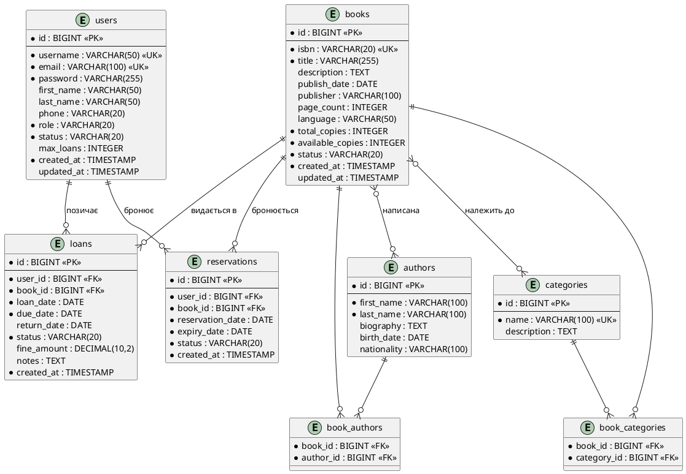

# Діаграма бази даних (ER-Diagram)

## PlantUML Entity-Relationship Diagram



## Текстове представлення зв'язків

### Один-до-багатьох (One-to-Many)

1. **users → loans**
   - Один користувач може мати багато позик
   - Кожна позика належить одному користувачу
   - `loans.user_id` → `users.id`

2. **books → loans**
   - Одна книга може бути видана в багатьох позиках
   - Кожна позика стосується однієї книги
   - `loans.book_id` → `books.id`

3. **users → reservations**
   - Один користувач може мати багато бронювань
   - Кожне бронювання належить одному користувачу
   - `reservations.user_id` → `users.id`

4. **books → reservations**
   - Одна книга може мати багато бронювань
   - Кожне бронювання стосується однієї книги
   - `reservations.book_id` → `books.id`

### Багато-до-багатьох (Many-to-Many)

1. **books ↔ authors** (через `book_authors`)
   - Одна книга може мати багато авторів
   - Один автор може написати багато книг
   - Зв'язкова таблиця: `book_authors`

2. **books ↔ categories** (через `book_categories`)
   - Одна книга може належати до багатьох категорій
   - Одна категорія може містити багато книг
   - Зв'язкова таблиця: `book_categories`

## Індекси

### Первинні ключі (Primary Keys)
- `users.id`
- `books.id`
- `authors.id`
- `categories.id`
- `loans.id`
- `reservations.id`
- `(book_authors.book_id, book_authors.author_id)` - composite
- `(book_categories.book_id, book_categories.category_id)` - composite

### Унікальні ключі (Unique Keys)
- `users.username`
- `users.email`
- `books.isbn`
- `categories.name`

### Зовнішні ключі (Foreign Keys)
- `loans.user_id` → `users.id`
- `loans.book_id` → `books.id`
- `reservations.user_id` → `users.id`
- `reservations.book_id` → `books.id`
- `book_authors.book_id` → `books.id`
- `book_authors.author_id` → `authors.id`
- `book_categories.book_id` → `books.id`
- `book_categories.category_id` → `categories.id`

### Додаткові індекси для оптимізації
```sql
CREATE INDEX idx_loans_user_id ON loans(user_id);
CREATE INDEX idx_loans_book_id ON loans(book_id);
CREATE INDEX idx_loans_status ON loans(status);
CREATE INDEX idx_loans_due_date ON loans(due_date);

CREATE INDEX idx_reservations_user_id ON reservations(user_id);
CREATE INDEX idx_reservations_book_id ON reservations(book_id);
CREATE INDEX idx_reservations_status ON reservations(status);

CREATE INDEX idx_books_title ON books(title);
CREATE INDEX idx_books_status ON books(status);

CREATE INDEX idx_authors_last_name ON authors(last_name);
```

## SQL DDL (Data Definition Language)

### Створення таблиць

```sql
-- Users table
CREATE TABLE users (
    id BIGSERIAL PRIMARY KEY,
    username VARCHAR(50) NOT NULL UNIQUE,
    email VARCHAR(100) NOT NULL UNIQUE,
    password VARCHAR(255) NOT NULL,
    first_name VARCHAR(50),
    last_name VARCHAR(50),
    phone VARCHAR(20),
    role VARCHAR(20) NOT NULL DEFAULT 'READER',
    status VARCHAR(20) NOT NULL DEFAULT 'ACTIVE',
    max_loans INTEGER DEFAULT 5,
    created_at TIMESTAMP NOT NULL DEFAULT CURRENT_TIMESTAMP,
    updated_at TIMESTAMP
);

-- Books table
CREATE TABLE books (
    id BIGSERIAL PRIMARY KEY,
    isbn VARCHAR(20) NOT NULL UNIQUE,
    title VARCHAR(255) NOT NULL,
    description TEXT,
    publish_date DATE,
    publisher VARCHAR(100),
    page_count INTEGER,
    language VARCHAR(50),
    total_copies INTEGER NOT NULL DEFAULT 1,
    available_copies INTEGER NOT NULL DEFAULT 1,
    status VARCHAR(20) NOT NULL DEFAULT 'AVAILABLE',
    created_at TIMESTAMP NOT NULL DEFAULT CURRENT_TIMESTAMP,
    updated_at TIMESTAMP
);

-- Authors table
CREATE TABLE authors (
    id BIGSERIAL PRIMARY KEY,
    first_name VARCHAR(100) NOT NULL,
    last_name VARCHAR(100) NOT NULL,
    biography TEXT,
    birth_date DATE,
    nationality VARCHAR(100)
);

-- Categories table
CREATE TABLE categories (
    id BIGSERIAL PRIMARY KEY,
    name VARCHAR(100) NOT NULL UNIQUE,
    description TEXT
);

-- Loans table
CREATE TABLE loans (
    id BIGSERIAL PRIMARY KEY,
    user_id BIGINT NOT NULL,
    book_id BIGINT NOT NULL,
    loan_date DATE NOT NULL,
    due_date DATE NOT NULL,
    return_date DATE,
    status VARCHAR(20) NOT NULL DEFAULT 'ACTIVE',
    fine_amount DECIMAL(10, 2) DEFAULT 0.00,
    notes TEXT,
    created_at TIMESTAMP NOT NULL DEFAULT CURRENT_TIMESTAMP,
    FOREIGN KEY (user_id) REFERENCES users(id) ON DELETE CASCADE,
    FOREIGN KEY (book_id) REFERENCES books(id) ON DELETE CASCADE
);

-- Reservations table
CREATE TABLE reservations (
    id BIGSERIAL PRIMARY KEY,
    user_id BIGINT NOT NULL,
    book_id BIGINT NOT NULL,
    reservation_date DATE NOT NULL,
    expiry_date DATE NOT NULL,
    status VARCHAR(20) NOT NULL DEFAULT 'PENDING',
    created_at TIMESTAMP NOT NULL DEFAULT CURRENT_TIMESTAMP,
    FOREIGN KEY (user_id) REFERENCES users(id) ON DELETE CASCADE,
    FOREIGN KEY (book_id) REFERENCES books(id) ON DELETE CASCADE
);

-- Book-Authors junction table
CREATE TABLE book_authors (
    book_id BIGINT NOT NULL,
    author_id BIGINT NOT NULL,
    PRIMARY KEY (book_id, author_id),
    FOREIGN KEY (book_id) REFERENCES books(id) ON DELETE CASCADE,
    FOREIGN KEY (author_id) REFERENCES authors(id) ON DELETE CASCADE
);

-- Book-Categories junction table
CREATE TABLE book_categories (
    book_id BIGINT NOT NULL,
    category_id BIGINT NOT NULL,
    PRIMARY KEY (book_id, category_id),
    FOREIGN KEY (book_id) REFERENCES books(id) ON DELETE CASCADE,
    FOREIGN KEY (category_id) REFERENCES categories(id) ON DELETE CASCADE
);
```

## Приклади даних (Sample Data)

```sql
-- Insert sample users
INSERT INTO users (username, email, password, first_name, last_name, role) VALUES
('admin', 'admin@library.com', '$2a$10$...', 'Адміністратор', 'Системи', 'ADMIN'),
('librarian1', 'librarian@library.com', '$2a$10$...', 'Олена', 'Книжник', 'LIBRARIAN'),
('reader1', 'ivan@example.com', '$2a$10$...', 'Іван', 'Петров', 'READER');

-- Insert sample authors
INSERT INTO authors (first_name, last_name, nationality) VALUES
('Тарас', 'Шевченко', 'Українець'),
('Іван', 'Франко', 'Українець'),
('Михайло', 'Коцюбинський', 'Українець');

-- Insert sample categories
INSERT INTO categories (name, description) VALUES
('Поезія', 'Поетичні твори'),
('Проза', 'Прозові твори'),
('Українська класика', 'Класична українська література');

-- Insert sample books
INSERT INTO books (isbn, title, publisher, publish_date, total_copies, available_copies) VALUES
('978-966-03-4567-8', 'Кобзар', 'А-БА-БА-ГА-ЛАМАГА', '2019-03-09', 3, 2),
('978-617-12-3456-7', 'Тіні забутих предків', 'Фоліо', '2018-06-15', 2, 0),
('978-966-441-123-4', 'Захар Беркут', 'Фоліо', '2020-01-20', 5, 3);
```

## Нормалізація бази даних

База даних відповідає **Третій нормальній формі (3NF)**:

### 1NF (Перша нормальна форма)
- Всі атрибути атомарні
- Немає повторюваних груп
- Кожна таблиця має первинний ключ

### 2NF (Друга нормальна форма)
- Відповідає 1NF
- Немає часткових залежностей від первинного ключа
- Всі non-key атрибути повністю залежать від первинного ключа

### 3NF (Третя нормальна форма)
- Відповідає 2NF
- Немає транзитивних залежностей
- Всі non-key атрибути залежать тільки від первинного ключа

## Обмеження цілісності (Constraints)

### Referential Integrity
- `ON DELETE CASCADE` для всіх зовнішніх ключів
- Видалення користувача видаляє всі його позики та бронювання
- Видалення книги видаляє всі зв'язки з авторами та категоріями

### Check Constraints (можуть бути додані)
```sql
ALTER TABLE books ADD CONSTRAINT check_copies
    CHECK (available_copies >= 0 AND available_copies <= total_copies);

ALTER TABLE loans ADD CONSTRAINT check_dates
    CHECK (due_date >= loan_date);

ALTER TABLE loans ADD CONSTRAINT check_fine
    CHECK (fine_amount >= 0);
```

### Not Null Constraints
- Критичні поля мають обмеження NOT NULL
- Дати, статуси, зовнішні ключі обов'язкові
