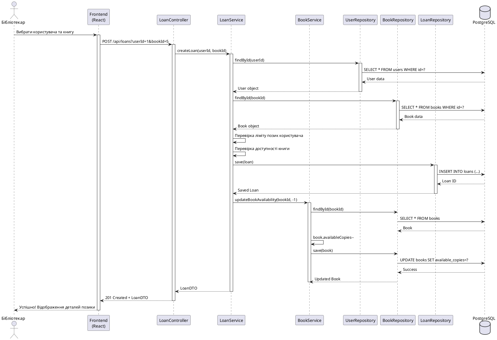
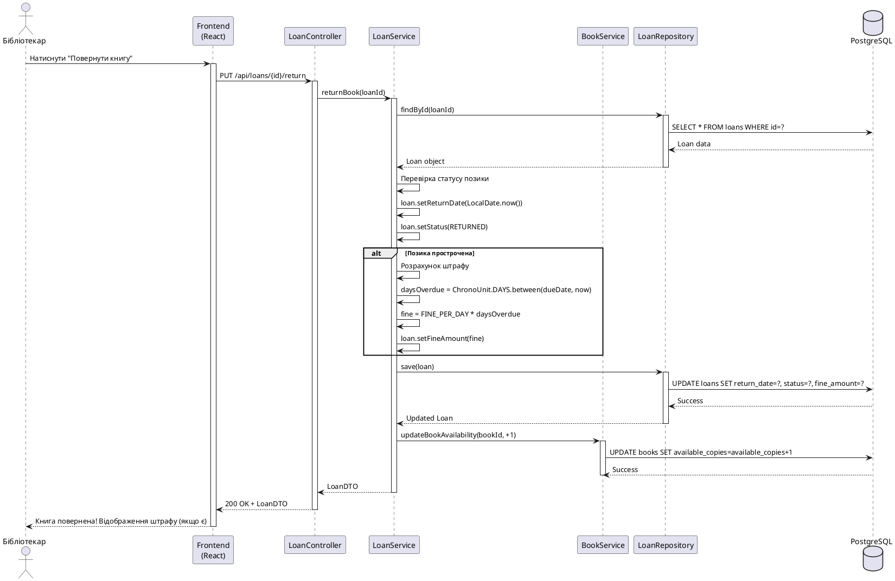
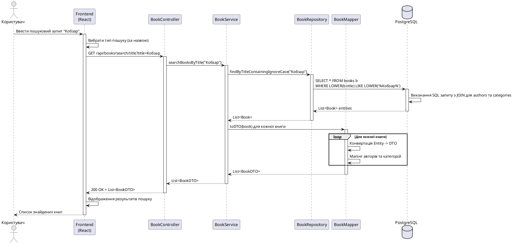
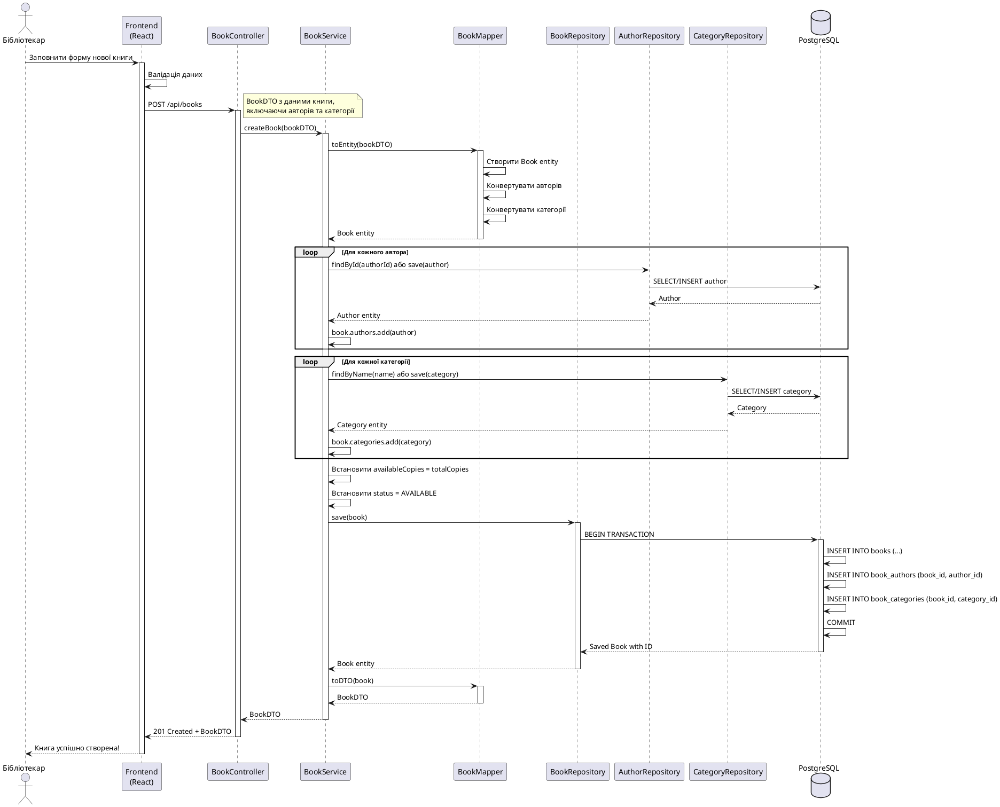
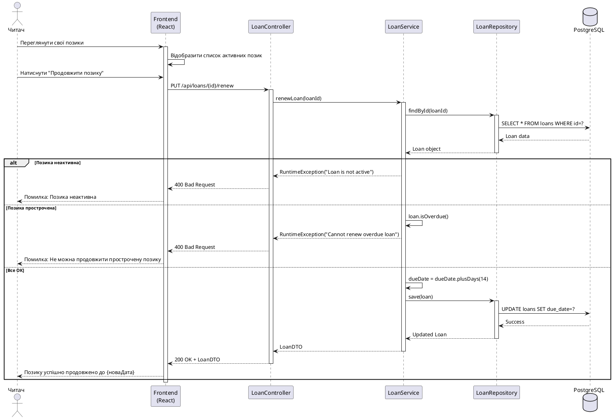

# Sequence Діаграми - Система керування бібліотекою

## 1. Процес видачі книги (Create Loan)

## 2. Процес повернення книги (Return Book)

## 3. Процес пошуку книг (Search Books)

## 4. Процес створення книги (Create Book)

## 5. Процес продовження позики (Renew Loan)

## Опис процесів

### 1. Видача книги
**Учасники:** Бібліотекар, Frontend, Backend Services, Database

**Основні кроки:**
1. Бібліотекар обирає користувача та книгу
2. Система перевіряє ліміт позик користувача
3. Система перевіряє доступність книги
4. Створюється новий запис позики
5. Зменшується кількість доступних примірників книги
6. Повертається інформація про позику

**Виключення:**
- Користувач досяг ліміту позик
- Книга недоступна

### 2. Повернення книги
**Учасники:** Бібліотекар, Frontend, Backend Services, Database

**Основні кроки:**
1. Бібліотекар обирає позику для повернення
2. Система встановлює дату повернення
3. Якщо є прострочення - розраховується штраф
4. Статус позики змінюється на RETURNED
5. Збільшується кількість доступних примірників книги
6. Повертається оновлена інформація про позику

**Бізнес-правила:**
- Штраф = 5 грн * кількість днів прострочення

### 3. Пошук книг
**Учасники:** Користувач, Frontend, Backend Services, Database

**Основні кроки:**
1. Користувач вводить пошуковий запит
2. Система виконує пошук у базі даних
3. Завантажуються пов'язані дані (автори, категорії)
4. Конвертація Entity -> DTO
5. Повернення результатів пошуку

**Типи пошуку:**
- За назвою (LIKE query)
- За автором (JOIN з таблицею authors)
- За категорією (JOIN з таблицею categories)

### 4. Створення книги
**Учасники:** Бібліотекар, Frontend, Backend Services, Database

**Основні кроки:**
1. Бібліотекар заповнює форму
2. Валідація даних
3. Обробка зв'язків Many-to-Many (автори, категорії)
4. Транзакційне збереження в БД
5. Повернення створеної книги

**Транзакційність:**
- Всі операції виконуються в одній транзакції
- У разі помилки - rollback

### 5. Продовження позики
**Учасники:** Читач, Frontend, Backend Services, Database

**Основні кроки:**
1. Читач обирає позику для продовження
2. Перевірка можливості продовження
3. Додавання 14 днів до терміну повернення
4. Збереження оновленої позики

**Обмеження:**
- Не можна продовжити неактивну позику
- Не можна продовжити прострочену позику
