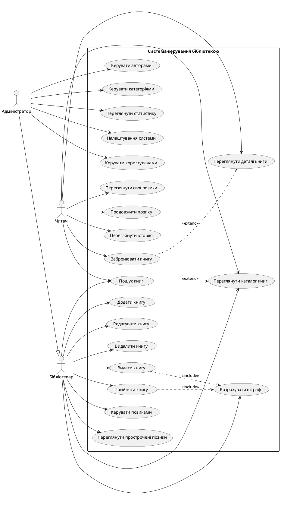

# Use Case Діаграма - Система керування бібліотекою

## PlantUML код

## Опис Use Cases

### Читач (Reader)

1. **Переглянути каталог книг (UC1)**
   - Перегляд всіх доступних книг у системі
   - Фільтрація за різними критеріями

2. **Пошук книг (UC2)**
   - Пошук за назвою, автором, категорією
   - Розширений пошук

3. **Переглянути деталі книги (UC3)**
   - Перегляд детальної інформації про книгу
   - Інформація про доступність

4. **Забронювати книгу (UC4)**
   - Бронювання недоступної книги
   - Отримання сповіщення про доступність

5. **Переглянути свої позики (UC5)**
   - Перегляд активних позик
   - Перегляд історії позик

6. **Продовжити позику (UC6)**
   - Продовження терміну повернення книги
   - Якщо немає прострочення

7. **Переглянути історію (UC7)**
   - Перегляд всіх попередніх позик
   - Статистика читання

### Бібліотекар (Librarian)

8. **Видати книгу (UC8)**
   - Видача книги користувачу
   - Реєстрація позики в системі

9. **Прийняти книгу (UC9)**
   - Прийом поверненої книги
   - Закриття позики

10. **Розрахувати штраф (UC10)**
    - Автоматичний розрахунок штрафу за прострочення
    - Реєстрація оплати штрафу

11. **Керувати позиками (UC11)**
    - Перегляд всіх позик
    - Редагування позик

12. **Переглянути прострочені позики (UC12)**
    - Перегляд списку прострочених позик
    - Відправка нагадувань

13. **Додати книгу (UC13)**
    - Додавання нової книги до системи
    - Вказання авторів та категорій

14. **Редагувати книгу (UC14)**
    - Оновлення інформації про книгу
    - Зміна кількості примірників

15. **Видалити книгу (UC15)**
    - Видалення книги з системи
    - Можливо тільки якщо немає активних позик

### Адміністратор (Admin)

16. **Керувати користувачами (UC16)**
    - Створення, редагування, видалення користувачів
    - Зміна ролей та статусів

17. **Керувати авторами (UC17)**
    - Додавання та редагування авторів
    - Управління біографіями

18. **Керувати категоріями (UC18)**
    - Створення та редагування категорій книг
    - Організація каталогу

19. **Переглянути статистику (UC19)**
    - Статистика використання системи
    - Популярні книги та автори

20. **Налаштування системи (UC20)**
    - Конфігурація системних параметрів
    - Управління правами доступу

## Взаємодії між акторами

- **Адміністратор** має всі права **Бібліотекаря** (генералізація)
- **Бібліотекар** може виконувати базові функції **Читача** (перегляд каталогу, пошук)
- Деякі use cases включають інші (include): видача/повернення книги включають розрахунок штрафу
- Деякі use cases розширюють інші (extend): пошук розширює перегляд каталогу
